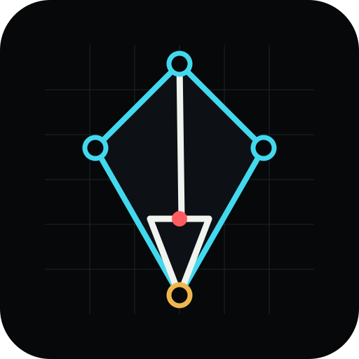
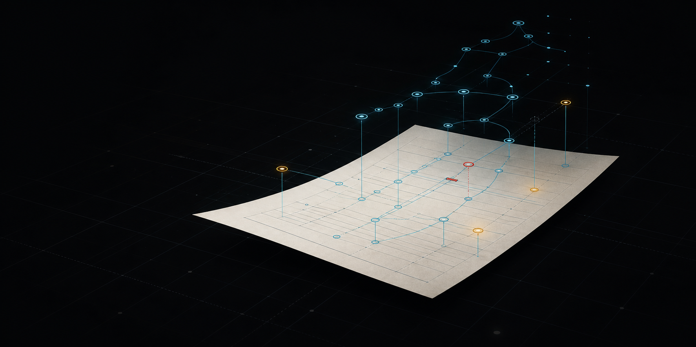

<p align="center"></p>

<h1 align="center">NovelGraph</h1>
<p align="center"><strong>The manuscript is the surface. The story is the system beneath it.</strong></p>
<p align="center">A local production environment for planning, drafting, auditing, and closing fiction through an inspectable workflow.</p>

<p align="center">
  <a href="https://www.npmjs.com/package/@actalk/novelgraph"></a>
  <a href="LICENSE"></a>
  <a href="https://github.com/CSandbatch/novelgraph/actions/workflows/ci.yml"></a>
  
</p>

<p align="center">
  <a href="https://csandbatch.github.io/novelgraph/">Website</a> ·
  <a href="https://csandbatch.github.io/novelgraph/demo/">Interactive demo</a> ·
  <a href="https://csandbatch.github.io/novelgraph/docs/getting-started/">Documentation</a> ·
  <a href="https://csandbatch.github.io/novelgraph/docs/roadmap/">Roadmap</a>
</p>



> NovelGraph 0.5 is alpha software. The transactional story core, conversational discovery flow, Fair-Play Detective rule pack, and local Studio vertical slice are available. Some production nodes still use compatibility adapters, and advanced series graph views remain under development.

## Start with a conversation

NovelGraph does not begin with a blank configuration form or a request to “write a novel.” It opens a Discovery Room. Sol, the user-facing coordinator, asks one consequential question at a time: what experience the book promises, what pressure can sustain its scenes, what the protagonist cannot admit, and what the ending must make newly legible.

Terra examines genre, structure, character pressure, contradictions, and possible story engines. Luna handles bounded extraction, retrieval, comparison, and validation. Their working notes remain in run-scoped scratchpads. Sol compacts those notes into a handoff dossier without erasing the source entries.

When the record is sufficient, the system presents Core, Stretch, and Wild story-thrust candidates. The author may combine, edit, reject, or approve them. Approval creates a Story Charter. Planning and drafting remain locked until that charter exists.

```text
book shell → discovery conversation → candidate thrusts
           → Story Charter approval → genre policy → production DAG
```

Creative assertions are proposals. Only the author approval service can promote them into canon.

## Run the local Studio

NovelGraph requires Node.js 22.13 or newer.

```bash
npx @actalk/novelgraph studio
```

Studio binds to `127.0.0.1` by default, creates `.novelgraph/studio.sqlite` inside the selected project, and opens the browser. Manuscripts, credentials, model responses, revisions, and graph state remain on the local machine. Listening on a LAN address requires an explicit option and warning.

Until the 0.5.0 npm packages are published, contributors can run the same application from this checkout:

```bash
corepack pnpm install
corepack pnpm --filter @actalk/novelgraph-studio dev
```

The [public demo](https://csandbatch.github.io/novelgraph/demo/) uses an immutable mystery fixture. It asks for no credentials, performs no model calls, and never receives a real manuscript.

## One book, several kinds of knowledge

Each book is self-contained. It can connect to an optional series graph without surrendering its own boundaries.

| Scope | Contents | Authority |
| --- | --- | --- |
| Literary | Criticism, theory, craft, genre rules, citations, and provenance | Guidance only |
| Series | Shared chronology, recurring entities, terminology, world rules, and cross-book obligations | Approved series canon |
| Book | Story Charter, characters, events, knowledge, clues, obligations, and accepted decisions | Authoritative for one book |
| Run | Agent hypotheses, contradictions, questions, comparisons, and handoff notes | Noncanonical scratch space |
| Narrative surface | Outlines, scenes, chapters, synopses, and exports | Revisioned expression of book state |

A book may select records from its series. If a proposed book fact conflicts with those records, NovelGraph opens a series-impact proposal. It does not choose a winner silently. Literary retrieval behaves differently again: a cited critical method can guide an analysis, but repetition across agent prompts cannot turn it into fictional truth.



## Production is a supervised graph

After charter approval, work moves through a durable directed graph:

```text
research → outline and scene plan → draft → deterministic validation
         → story-graph proposal → continuity or mystery audit
         → reader panel → revision → re-audit → approval → closure
```

Every node declares typed inputs, outputs, artifact visibility, capabilities, budget, retry policy, and dependencies. Jobs persist timestamps, costs, logs, artifacts, cancellation state, and resumable errors. A drafting node may write prose without gaining permission to rewrite canon. A reader persona can receive the reader-visible projection without seeing sealed mystery facts. A research node may collect a source without admitting its claims into the book graph.



## Closure means accounting for the book's debts

NovelGraph records setups, clues, promises, dependencies, deadlines, character commitments, and other story obligations. Publication is blocked while a hard obligation remains unresolved. The author can resolve it, document a deliberate deferral, or approve a waiver with a rationale that remains visible in the closure report.

The Fair-Play Detective 2026 pack adds a sealed solution, evidence ledger, chronology, access matrix, character-knowledge boundaries, hypotheses, false solutions, clue distribution, and adversarial solver. Decisive clues must appear before their deductions. The final explanation must fit the disclosed evidence better than plausible alternatives. Technical evidence carries provenance, custody, reliability, and interpretation instead of functioning as an oracle.

The independent English Prose Patterns 2026 pack identifies phrases and structural tendencies for inspection. It does not infer authorship, label text as machine-generated, or rewrite a passage automatically. Manuscript findings are advisory. NovelGraph applies the same catalog more strictly to its own public copy.

## Studio surfaces

- Discovery Room: conversation, current understanding, confidence, open questions, contradictions, literary citations, scratchpads, and candidate thrusts.
- Knowledge Workbench: book canon, selected series records, literary retrieval, proposals, lineage, and handoffs.
- Editor: chapter and scene navigation, autosave, comments, citations, diagnostics, immutable revisions, diffs, rollback, and approval.
- Story Inspector: characters, relationships, knowledge boundaries, chronology, obligations, clues, suspects, and alibis.
- DAG Control Room: topology, status, budget, artifacts, logs, cancellation, retry, and resume.
- Review Center: deterministic findings, reader reactions, proposed revisions, canon impact, approval, rejection, and waiver history.
- Export Center: manuscript, Markdown, ebook metadata, citation report, closure report, and exact reasons for a blocked release.

Every graph view must have a table or outline alternative. The interface supports keyboard navigation, visible focus, reduced motion, non-color status symbols, and WCAG 2.2 AA contrast. Cyan carries structural meaning; electric blue marks selected paths and active discovery details. Warnings, failures, and completion retain distinct semantic colors and symbols.

## Repository map

- `packages/core`: schemas, SQLite migrations, discovery, knowledge scopes, story graph, mystery rules, provenance, budgets, and workflow engine.
- `packages/cli`: the `novelgraph` command and packaged Studio launcher.
- `packages/studio`: Hono API, React application, local data source, and fixture data source.
- `packages/site`: Astro/Starlight website, documentation, and static interactive demo.
- `docs/diagrams`: canonical Mermaid sources for architecture, state, sequence, and release diagrams.
- `scripts`: reference generation, copy review, diagram rendering, package checks, and release support.

## Develop and verify

```bash
corepack pnpm install
corepack pnpm -r build
corepack pnpm -r test
corepack pnpm -r typecheck
corepack pnpm copy:lint
corepack pnpm diagrams:check
corepack pnpm site:build
```

Package acceptance also packs all three public artifacts and installs them in clean temporary projects. Browser acceptance covers discovery, charter approval, series attachment, literary retrieval, editing, DAG execution, review, closure, and export.

Read [CONTRIBUTING.md](CONTRIBUTING.md) before submitting a change. Security reports belong under the process in [SECURITY.md](SECURITY.md), not in a public issue. The [architecture guide](https://csandbatch.github.io/novelgraph/docs/concepts/architecture/) explains the transaction and permission boundaries.

## Boundaries

NovelGraph is English-only, local-first, single-author software. It has no account system, cloud manuscript sync, or collaborative editing. Markdown and JSON are exports; SQLite is authoritative. Open-web research remains untrusted until the author approves a cited claim. A passing closure gate establishes internal accounting, not literary merit, market fit, or factual truth.

## License

[MIT](LICENSE). Original NovelGraph code and identified project assets use this license. Supplied reference works and captured research retain their own rights and are never folded into the literary library without provenance and permission.
